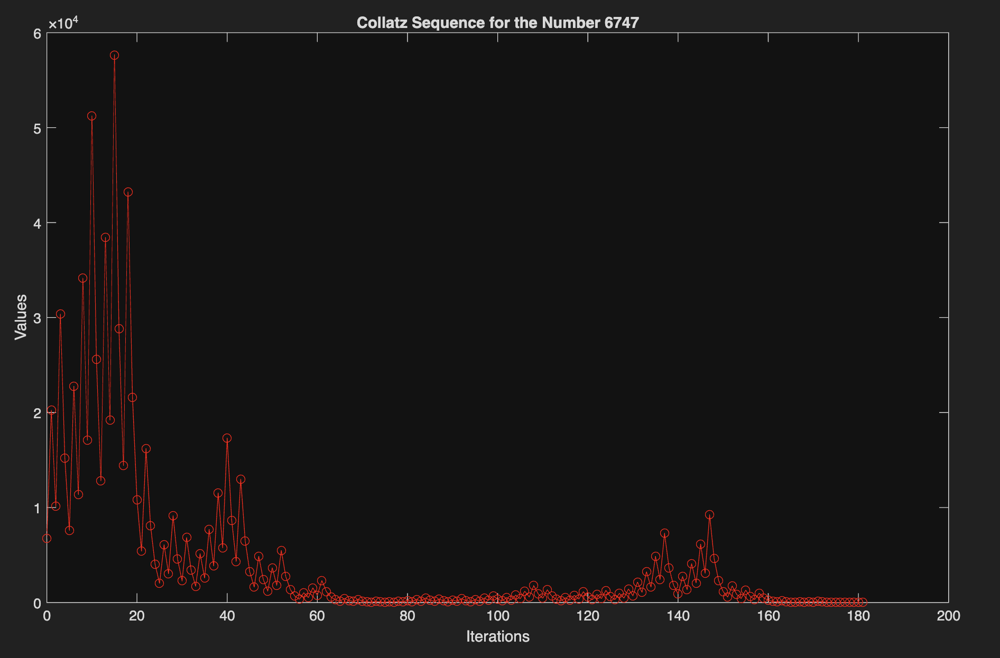
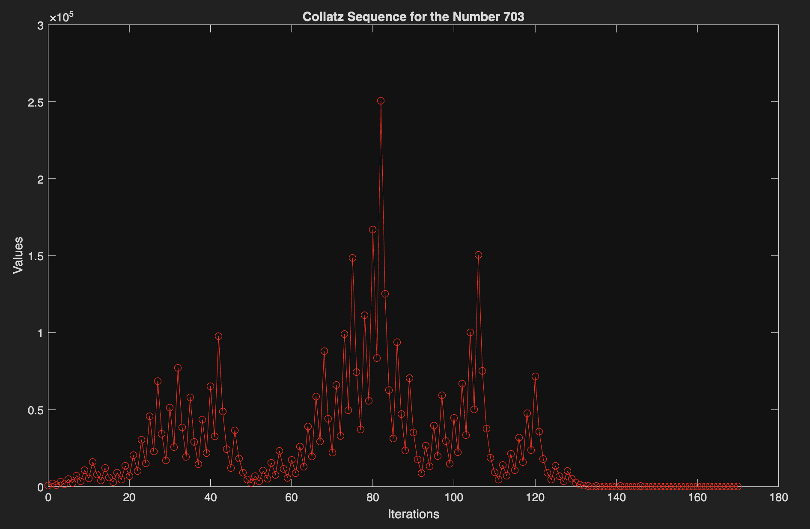

# collatzHunter
MATLAB tool for visualizing and analyzing properties of Collatz sequences

# Overview
This project provides a MATLAB tool for visualizing and examining Collatz sequences.

The function computes the Collatz sequence for single positive integer starting values and plots the sequence values against their corresponding iteration numbers, along with a text description of the total number of iterations, maximum value, and iteration at which the maximum value occurs in the sequence.

This function can also calculate these quantities for a range of input values, provided the range includes only positive integers, and outputs this data in a structure array.

# The Collatz Conjecture

Suppose we start with a positive integer, say $$7$$. If this number is even, we divide by $$2$$. If it is odd, we multiply by $$3$$ and add $$1$$. $$7$$ is odd, so we begin by multiplying it by $$3$$ and adding $$1$$, which gives $$22$$. $$22$$ is even, so divide by $$2$$ to get $$11$$. $$11$$ is odd, so multiply by $$3$$ and add $$1$$ to get $$34$$. If you continue this pattern of dividing by $$2$$ if the number is even and multiplying by $$3$$ and adding $$1$$ if it is odd, you will eventually reach the value of $$4$$, which is where things become interesting.

$$4$$ is even, so we divide by $$2$$ to get $$2$$. $$2$$ is also even, so we divide by $$2$$ to get $$1$$. $$1$$ is odd, so multiply by $$3$$ and add $$1$$ to get $$4$$. Notice we ended up back where we started, and if we continue, the sequence will remain stuck in a $$4$$ &rarr; $$2$$ &rarr; $$1$$ loop forever.

If you try another starting number such as $$14$$, $$1000$$, or even $$2^{68}$$, the sequence will always degenerate into this $$4$$ &rarr; $$2$$ &rarr; $$1$$ loop. Although it is unproven, the speculation that this holds for all positive integers is known as the Collatz conjecture. 

Proving or disproving the Collatz conjecture has been an open problem in mathematics since it was first introduced almost 100 years ago. It is an exceedingly difficult problem to approach due to the seemingly random behavior of sequences. The mathematician Jeffery Lagarias even described it as "completely out of reach of present day mathematics."

# Features

* Calculates Collatz sequences for single starting values and logs iteration values

* Plots sequence values against their corresponding iteration values

* Gives a text description of the sequence detailing the total number of iterations before degeneracy, the maximum value in the sequence, and the iteration at which the maximum value occurs

* Calculates the aforementioned values for a range of starting values and places them in a structure array

Note that I define degeneracy as the point at which the sequence reaches the value of 1 for the first time. The function will only track values and iterations up to this point.

# Example Sequences and Demo

Below are a few examples of sequences I have plotted with the function. I have uploaded more example plots, a demo script, and an example of a structure array the function will output when considering a range of initial values in the main repository.

| Sequence for 6747 | Sequence for 703 |
|--------|-------------|
|  |  |

# Quick Start

1. Download or clone the repository

2. Add the folder to your MATLAB path

3. Run the function with your chosen input parameters

# Function Syntax

collatz = collatzHunter(range)

Inputs:

* range: a positive integer scalar, or 1x2 or 2x1 vector of positive integers

Outputs:

* collatz: A text description of the sequence if the input is a positive integer scalar

* collatz: A 1xm structure array containing the fields Values, Iterations, MaxVals, and MaxValIters

* collatz: A text description detailing the error with the input or syntax if inputs are not valid 

Examples:

* collatz = collatzHunter(255)

* collatz = collatzHunter([5000 6000])

* collatz = collatzHunter([2000000; 30000000])

Note that the input must be either a positive integer scalar, a 1x2 row vector containing positive integers in ascending order according to linear indexing, or a 2x1 column vector containing positive integers in ascending order according to linear indexing.

Also note that the first element of an input vector is the lower bound of your test values range and the second element is the upper bound. As such, the first element must be less than the second element.

# Project Motivation

I originally built this function as a tool to prove or disprove the Collatz conjecture by testing all possible initial values and looking for any numbers that might violate the conjecture. However, I ran into the same problem as with my primeHunter function, which is floating point representation of numbers greater than $$2^{53}$$.

Since my function relies on modular arithmetic to calculate sequence values, it needs accuracy in integer representation, which MATLAB cannot provide beyond $$2^{53}$$. Furthermore, the conjecture has been verified for every positive integer below $$2^{68}$$ using powerful supercomputers, so I can't test new values for compliance. Actually, testing every possible value to see if the conjecture holds is a terrible way to go about proving or disproving it, but alternative methods for rigorous proofs or disproofs remain elusive for the time being.

I find it interesting to consider what a violation of the Collatz conjecture would even look like. If the user experiments with the function long enough, they may notice a few properties that hint at what violations could look like. Since any power of $$2$$ is even by definition, that immediately suggests that powers of $$2$$ are excluded from violating the conjecture, since it would always degenerate without ever triggering the odd condition.

Additionally, any number that violates the conjecture must have a sequence that contains a value that also violates the conjecture (for example, use the function to generate a graph of the sequence for $$937$$ and compare with that of $$703$$; in particular, examine what happens at and after iteration $$3$$ in the sequence of $$937$$ and compare with the behavior of the sequence of $$703$$). These observations suggest that any violation of the Collatz conjecture cannot be a power of $$2$$ and that its sequence cannot include any number known to degenerate.

If graphs similar to those generated by my function were to be created for these hypothetical violations, they could either increase forever to infinity, get stuck in a loop distinct from $$4$$ &rarr; $$2$$ &rarr; $$1$$, or simply meander between $$1$$ and infinity without increasing unbounded or getting stuck in a loop.

This was one of my favorite MATLAB projects to work on since the Collatz conjecture is steeped in such mystery. Why should every postive integer degenerate no matter how large it is? Do violations exist and if so, do their sequences go off to infinity, get stuck in an undiscovered loop, or simply meander? Why is it that no one can seem to figure out how to prove or disprove the conjecture? I hope the user has as much fun as I did pondering these questions and exploring the mystery of the Collatz conjecture with this function.

Also, for anyone who is interested, here is a rather interesting Wikipedia article about the Collatz conjecture: [https://en.wikipedia.org/wiki/Collatz_conjecture](https://en.wikipedia.org/wiki/Collatz_conjecture)
